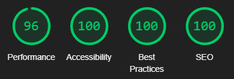

# Persönliche Webseite für Maik Kreutzer

> 🌐 Webseite: [https://maik-kreutzer.netlify.app/](https://maik-kreutzer.netlify.app/)

> 👷‍♀️In dieser README wird die Architektur des Projektes erklärt

## 💻 Tech Stack
- Die Basis bildet das Web-Framework [Astro](https://astro.build/)
- Die Komponenten werden entsprechend mit JavaScript und HTML umgesetzt
- Die Styles werden mit CSS geschrieben

## 🗂️ Übersicht über die Komponenten
- Die Komponenten befinden sich im Ordner `./src/components/`
- Diese werden in der Datei `./src/pages/index.astro` eingebunden
- Die zwei Layout-Wrapper für die Projekte und Blogs liegen in `./src/layouts/`
- Die entsprechenden Inhalte liegen in `./src/content/`
- Verwendete Icons werden als SVG-Tags im Ordner `./src/components/icons/` abgelegt

## ⌘ Commands

| Command                   | Action                                             |
| :------------------------ |:---------------------------------------------------|
| `npm install`             | Abhängigkeiten installieren                        |
| `npm run dev`             | Startet lokalen Server `localhost:3000`            |
| `npm run build`           | Bauprozess für die Produktion zum Ordner `./dist/` |
| `npm run preview`         | Vorschau der gebauten App vor Deploy               |

## 🚀 Deployment
- Die Webseite wird mit dem Tool [Netlify](https://www.netlify.com/) deployed
- Das GitHub-Repository der Webseite ist mit einem Netlify-Konto verknüpft
- Wird ein neuer Commit auf den `master`-Branch gepusht, wird die Webseite automatisch neu gebaut und deployed

## 📈 Performance Score
Mit dem Tool Lighthouse von Google wurde die Performance der Webseite gemessen:

## 📝 License
[MIT](https://choosealicense.com/licenses/mit/)

## 📧 Kontakt
- [GitHub](https://github.com/kreutzermaik)
- [LinkedIn](https://linkedin.com/in/maik-kreutzer-889a79197)
